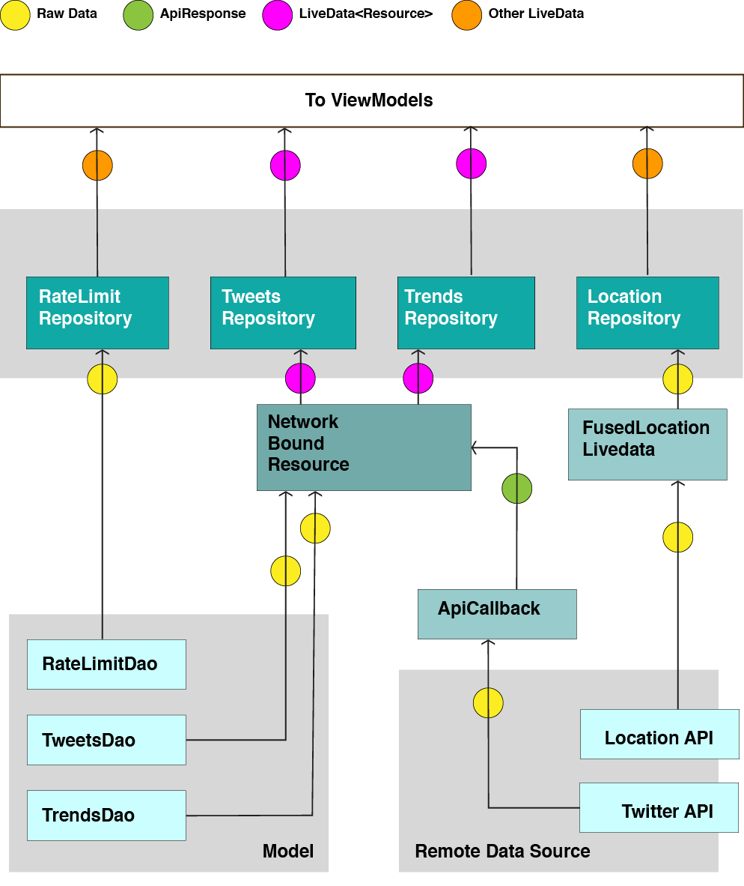

# Shift⋅t : Capstone Project
Final project for the Udacity Android Developer Nanodegree

## Project Requirements

In order to run this project locally, several API keys are required. The keys should be stored in
 a file name `apikey.properties` that should live in the project root folder.
  The file should contain the following String variables:
  
 * `google_geo_api_key`
 * `twitter_consumer_key`
 * `twitter_consumer_secret`
 
The keys would be supplied as part of the 
 submission as they are not provided in this repository.

## Project Specification

Shift⋅t is an application that shows Twitter activity in your local area. Using the user’s location,
the application will show tweets and trends in real time.

At this stage, the application only shows tweets that have the 'place' property populated. Not all tweets provided in the network response have location information attached to them. As a consequence, some areas will show a very small number of tweets.

>[Udacity Project Specification](https://review.udacity.com/#!/rubrics/65/view)

>[Project rubic](Capstone_Stage1.pdf)

## Implementation
As a requirement, this project is written using only Java.

Application integrates two Google services

*  Google Location service
*  Google Map service 

Application uses dependency injection which is implemented with the use of Dagger 2. 


Application architecture was implemented following the Android Developer guidelines. It also 
implements recommendations on how to expose network status so that is able to prompt the user with information related to the network status e.g.: loading, error, connectivity status.


I used the [android-architecture-components/GithubBrowserSample/](https://github.com/googlesamples/android-architecture-components/tree/master/GithubBrowserSample/app/src/main/java/com/android/example/github/vo) sample as guidance. Although the sample is 
written in Kotlin,  my implementation was written in Java as per project requirement.  

### Data Strategy
Initially the application requests the device location. Every location request is preceded by location permission and connectivity checks. The user is prompted for input if this is not in place.

After the location is obtained, the user can select to load tweets or trends data. It is decided then whether the data provided to the UI comes from the database or the network based on a series of 'rate limit’ rules. If a network request is required the request will always be preceded by connectivity checks. 

#### Location
The application uses `FusedLocationProviderClient` to retrieve location from the Google Location 
API . Location is provided as LiveData. [FusedLocationLiveData](app/src/main/java/uk/me/desiderio/shiftt/data/location/FusedLocationLiveData.java) class is an extension of LiveData<Location>. The class initiates location requests when it becomes active 

Location data is persisted as Preferences. Some of the data like latitude, longitude and a timestamp, is set by the system using the Google Location Services. The search area, defined by length of its radio and the units of this radius, are set by the user via the Setting activity.


#### Network

##### Twitter Kit API
The application integrates Twitter data into the application and uses 3 different endpoints:

###### Twitter Search
In order to retrieve tweets relevant to the user’s location, the TwitterApiClient API is used. 
The  Twitter client provides a **[search service](https://developer.twitter.com/en/docs/tweets/search/api-reference/get-search-tweets.html)** using:

```twitterApiClient.getSearchService().tweets()```

The following parameter are required:

* location defined by its latitude and longitude
* search area defined by 
	* radius ( in km or miles ) of the area
	* the units of this value

###### Retrieving Trends
In order to retrieve trends, two requests are needed. A client extending the TwitterApiClient has been implemented that provides these two services. Retrofit is used for this implementation.

**[GET trends/closest](https://developer.twitter.com/en/docs/trends/locations-with-trending-topics/api-reference/get-trends-closest.html)**

```https://api.twitter.com/1.1/trends/closest.json```

Returns the locations that Twitter has trending topic information for, closest to a specified location. Locations have an id that corresponded to the location’s Yahoo Location ID (WOEID)
Resource URL.

**[GET trends/place](https://developer.twitter.com/en/docs/trends/trends-for-location/api-reference/get-trends-place)**

```https://api.twitter.com/1.1/trends/place.json```

Returns the top 50 trending topics for a specific WOEID, if trending information is available for it. The tweet_volume for the last 24 hours is also returned for many trends if this is available.

##### Rate Limiting
The app implements a rate limiting strategy that determines whether a new request to the Twitter API should go ahead. This feature will limit the number of request made to the API based on two factors:

* **Age of data** : determines if the data should be considered stale based on locally generated timestamps
* **Twitter Rate Limit** : Twitter limits the number of requests that could be made to each endpoint in a 15min periods called 'window'. Three parameters are considered in order to decide whether a request should go ahead. These parameters are provided as part of every response header:

	* *`x-rate-limit-limit`*: the rate limit ceiling for that given endpoint
	* *`x-rate-limit-remaining`*: the number of requests left for the 15 minute window
	* *`x-rate-limit-reset`*: the remaining window before the rate limit resets, in UTC epoch seconds


This information is persisted in the database using the [RateLimitsRepository](app/src/main/java/uk/me/desiderio/shiftt/data/repository/RateLimitsRepository.java).

#### Data Persistence
Data persistence is implemented with the use of Android Jetpack components:

* **Room** : Database creation and data persistence
* **Viewmodel** : Handling UI data in a efficient manner
* **LiveData** : Providing data using a reactive approach with an extensive use of _Transformations_ and _MediatorLiveData_.


One of the challenges of the app was the large size of the [Tweet data object](https://developer.twitter.com/en/docs/tweets/data-dictionary/overview/tweet-object.html). There was a need to store certain parts of this data object in its own tables to facilitate data querying and data accesability. 

There are two types of Tweet stored in the database:

* Tweets returned as part of the search request.
* Tweets that are part of the metadata of each of the Tweet data object returned in the search request. These are stored in the Tweet properties *retweetedStatus* and *quotedStatus*. These tweets are ignored when querying the database and won’t show either on the map or the tweet list as their location is not related to the location provided for the search.

**[ShifttDatabase](app/src/main/java/uk/me/desiderio/shiftt/data/database/ShifttDatabase.java)** extends the RoomDatabase and provides the following data access objects:

* **[TweetsDao](app/src/main/java/uk/me/desiderio/shiftt/data/database/TweetsDao.java)**: provides resources containing Tweet or MapItem data objects
* **[TrendsDao](app/src/main/java/uk/me/desiderio/shiftt/data/database/TrendsDao.java)**: provides 
resource containing TrendEnt data objects
* **[RateLimitDao](app/src/main/java/uk/me/desiderio/shiftt/data/database/RateLimitDao.java)**: 
handles RateLimit data objects.


#### Data Layer: coordinating data
Data operations are handled by 4 different repositories:

* **[LocationRepository](app/src/main/java/uk/me/desiderio/shiftt/data/repository/LocationRepository.java)** : provides location details for the Twitter request. It persists location data as a Preferences
* **[TweetsRepository](app/src/main/java/uk/me/desiderio/shiftt/data/repository/TweetsRepository.java)** : provides 'Tweet’ objects for the list and 'MapItem’s to show on the map.
* **[TrendsRepository](app/src/main/java/uk/me/desiderio/shiftt/data/repository/TrendsRepository.java)** : provides ’TrendEnt’ objects for the list.
* **[RateLimitsRepository](app/src/main/java/uk/me/desiderio/shiftt/data/repository/RateLimitsRepository.java)** : handles rate limit  information for each endpoint.


Repositories uses a set of classes that handle network data retrieval and data persistence: 

* **[NetworkBoundResource](app/src/main/java/uk/me/desiderio/shiftt/data/repository/NetworkBoundResource.java)** class, an implementation of the Template Method pattern, sets logic and steps in order to retrieve data in a number of scenarios.
The class handles the retrieval of data and determines whether the data should be retrieved from the network or the database.

* A different bound resource class is also implemented, the **[NetworkBoundBiResouce](app/src/main/java/uk/me/desiderio/shiftt/data/repository/NetworkBoundBiResource.java)** class, to solve the issue of requested data been dependent on two consecutive network requests e.g.: trend data.

* **[ApiCallback](app/src/main/java/uk/me/desiderio/shiftt/data/network/ApiCallback.java)** class, an extension of the Retrofit's  Callback, provides network response data as LiveData of ApiResponse

* **[ApiResponse](app/src/main/java/uk/me/desiderio/shiftt/data/network/ApiResponse.java)** class is a data object that will hold the network request response. There are different implementations of the interface so to reflect the different outcomes of a network request: Empty, Success or Error.

* **[Resource](app/src/main/java/uk/me/desiderio/shiftt/data/repository/Resource.java)** 
class is a data object to be used on the UI. it holds the data requested, a message and a status. A Resource can have one of the following 4 statuses: no_connection, loading, success or error.

Essentially the The NetworkBoundResouce reacts to and handles ApiResponses that it receives as input. It then produces and outputs Resource object to be consumed by the UI.



#### Other classes

* **[AppExecutors](app/src/main/java/uk/me/desiderio/shiftt/util/AppExecutors.java)** class is used for concurrent execution. Its implementation follows guidelines from the Android CodeLabs' "Build an App with Architecture Components"

## UI
### The App
All activities in the application are 'Resource' aware and handle the  Resource data object provided by the data layer to update the UI with data and the network state. 


The UI is made of 4 distinctive views:

* Map Location View
* Map Neighbourhood View : where tweets info is displayed on a map as drawn polygons of the areas with twitter activity.
* Tweet List View: list of tweets for neighbourhood area
* Trend List View : list of trends in the area.

*Tweets* are first shown on a map organised by place (normally with city granularity). The map will show areas where there has been some Twitter activity. After the user select and area in the map, a list of tweets is shown for that specific area.

*Trends* are shown in a list.

The *Map Location view* and the *Map Neighbourhood view* are implemented as the same activity. The activity has two view states to provide each view. This approach facilitates transition between these two screens as the same instance of the SupportMapFragment is used in both.

*Tweet List View* and *Trend List View* are implemented as fragments that could be used in the two different UI flows:

* *Default flow*: The views are displayed in different activities.
* *Table in landscape flow*: are displayed in a frame in the Main Activity.

All activities use the [NetworkStateResourceActivity](app/src/main/java/uk/me/desiderio/shiftt/NetworkStateResourceActivity.java)
as super class. The class handles the progress bar and  the snackbar states. It also provides a default option menu.

#### Layout

The layout is structured so that code reuse is maximised. This is done with the use of layout files containing a `<merge>` tag as root. It used for those layout items that are present in more than one activity or for those views that are handled by the NetworkStateResourceActivity parent activity.

An alternative <merge> layout file is provided for tablets in landscape.

#### SnackDelegate class
Helper class that generates and shows Snackbar based on parameters provided. Snackbar is shown in the following events:

* error
* no connection
* restablished connection 

Snackbar will show different messages and behaviours depending on the type provided as parameter request.

### FAB Menu Library

An Android library is implemented as part of the project. The library implements a custom view that acts as container of a set of FABs. The container handles the opening and closing of the menu. The library also implements a CoordinatorLayout’s Behaviour for the Snackbar so that the menu animates when the Snackbar is shown

## Testing
The project includes unit test and instrumented test for some of the applicatin packages:

* Unit test: network and repository packages
* Instrumented test: database package.

### Libraries
This is a list of the
external libraries used in the project:

* [google services / location](https://developers.google.com/android/reference/com/google/android/gms/location/package-summary)
* [google services / maps](https://developers.google.com/android/reference/com/google/android/gms/maps/package-summary)
* [google / dagger 2](https://google.github.io/dagger/)
* [square / retrofit](https://github.com/square/retrofit)
* [twitter / core & ui](https://github.com/twitter/twitter-kit-android)
* androidx / arch & lifecycle
* androidx testing dependencies

For a list of support and other Android libraries, see the
[build.gradle](app/build.gradle) file

### Contact:
labs@desiderio.me.uk


